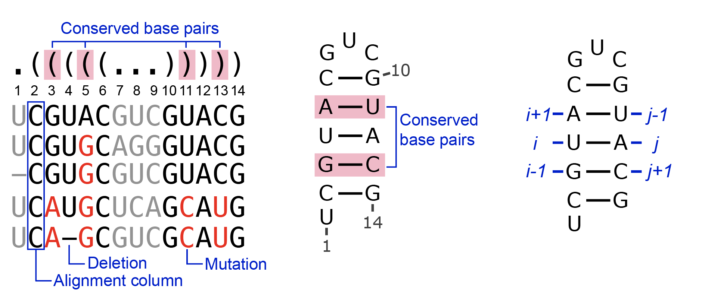
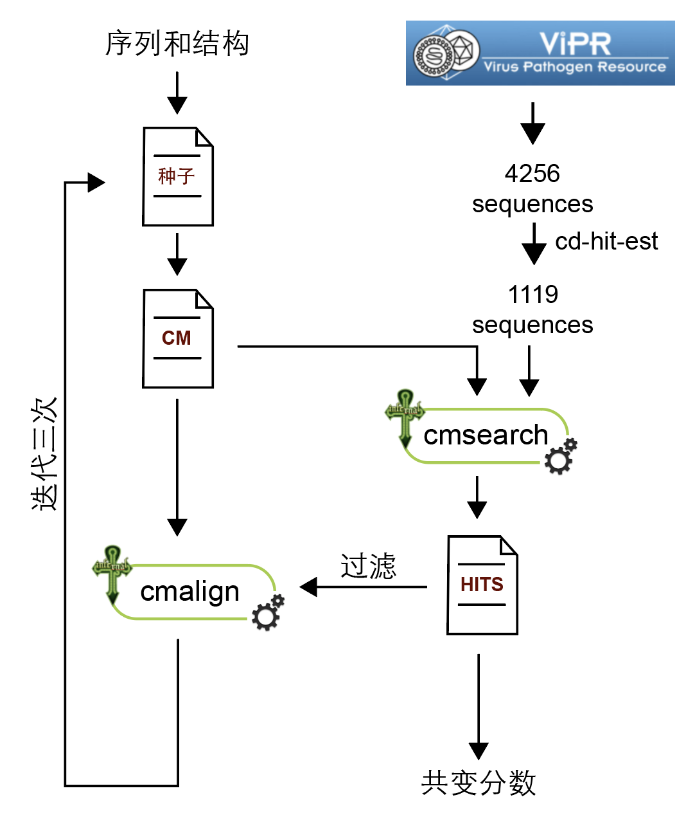
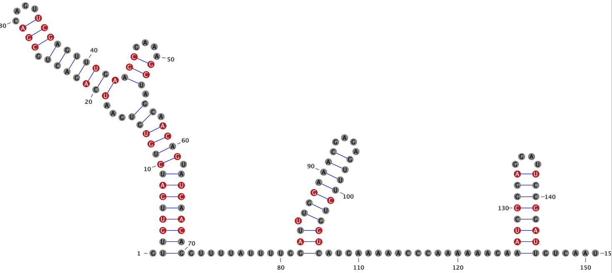
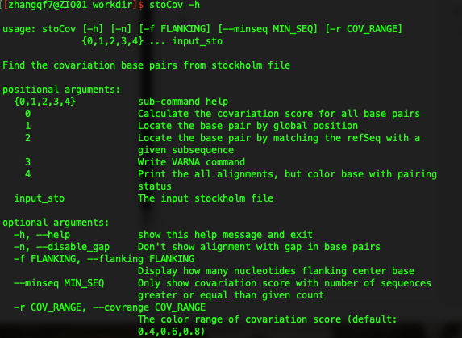
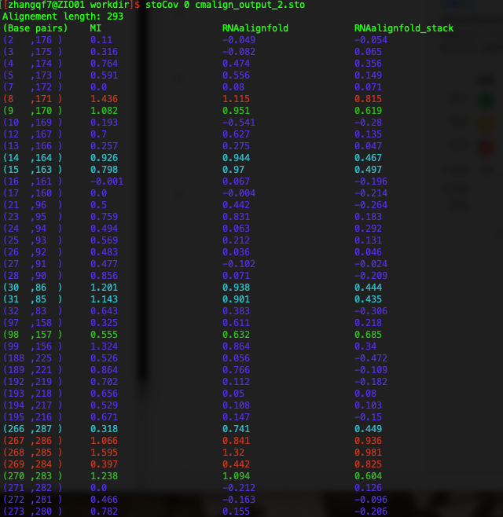
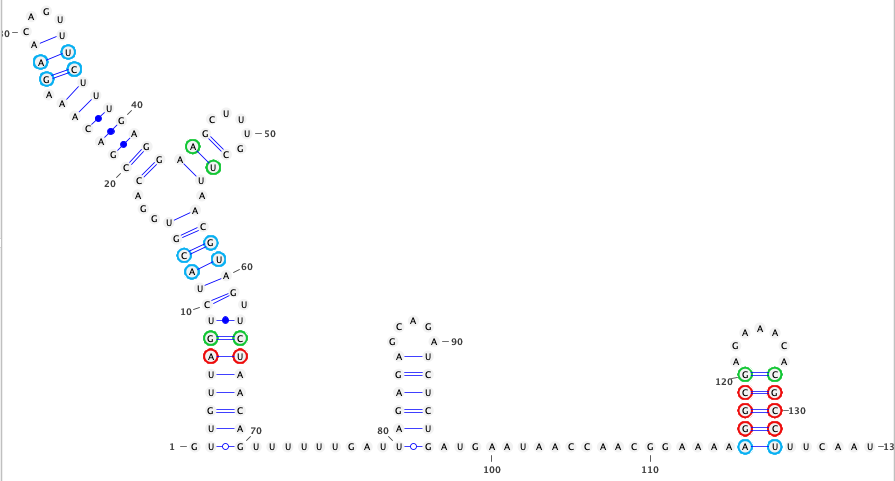
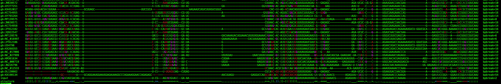

<center><h1>RNA Covariation Analysis</h1></center>

### 1.介绍

​	共变分析的主要目的是找出RNA结构中保守的碱基对，也叫做比较序列分析、进化分析（phylogentics analysis）。下图是分析的原理：



发生突变的碱基对仍然能够维持RNA二级结构不发生改变，则这些碱基对就是潜在的共变碱基对，可能具有重要的功能。

### 2. 安装相关程序

1. [IPyRSSA](https://github.com/lipan6461188/IPyRSSA)下的`Covariation.py`中包含了很多共变分析的Python3代码。安装IPyRSSA的方式：

   ```bash
   git clone https://github.com/lipan6461188/IPyRSSA.git
   export PYTHONPATH=/path/to/IPyRSSA:$PYTHONPATH
   ```

2. [R-scape](http://www.eddylab.org/R-scape/)是一个通过显著性检验计算保守碱基对的工具

3. [Infernal](http://eddylab.org/infernal/)可以构建共变模型，并搜索结构元件，包含了cmbuild、cmcalibrated、cmsearch、cmalign等工具

4. [BLAST+](https://www.ncbi.nlm.nih.gov/books/NBK279671/)可以过滤掉cmsearch的一些假阳性hits，这是可选项

5. 当前目录下的stoCov工具，主要用于可视化

6. [VARNA](http://varna.lri.fr/)是一个RNA二级结构可视化的工具

### 3. 流程介绍

​	在病毒上寻找保守的结构元件，大致流程如下所示：



1. __准备目标序列数据库__：首先从相关的数据库（这里是ViPR）中收集序列，然后去除其中高度相似的序列，做成参考序列数据库
2. __准备种子文件__：输入序列和二级结构，做成种子，使用cmbuild和cmcalibrate构建共变模型（CM）
3. __搜索目标序列__：使用CM到序列数据库中搜索同源序列，cmsearch会同时考虑结构和序列
4. __过滤__：从搜索到的结果中过滤掉高度相似的序列、含AUCG以外碱基的序列、二级结构模型不成立的序列以及含有太多gap的比队列。整合blast可以去除cmsearch中的假阳性。
5. __重新比对__：使用cmalign重新把过滤的序列比对到CM上，并重复2~5步三次

### 4. 基本操作

Infernal包中的程序可以在命令行中使用，也可以使用Python来调用。下面的介绍全部基于Python来调用。以Zika病毒的5’UTR为例。

```python
import General, Covariation # 导入IPyRSSA中的两个包

# 这里设置你自己的数据目录和工作目录
DATA_DIR = '/Share2/home/zhangqf7/tmp/covariation/new_pipe/data'
WORK_DIR = '/Share2/home/zhangqf7/tmp/covariation/new_pipe/workdir'

# 读入数据
UTR_5_seq,UTR_5_dot = General.load_dot(os.path.join(DATA_DIR, "PRVABC59_5UTR.dot"))['PRVABC59_5UTR']

# 把序列和二级结构存储为stockholm文件
input_sto = os.path.join(WORK_DIR, 'input.sto')
Covariation.dot2sto({'input':[UTR_5_seq,UTR_5_dot]}, "input", input_sto, refSeq=None, GS_DE=None, mode='w')
```

#### 4.1 cmbuild

```python
out_CM = os.path.join(WORK_DIR, 'input.cm')
Covariation.cmbuild(input_sto, out_CM, verbose=False, showCMD=True)
```

#### 4.2 cmcalibrate

`cmcalirate`比较慢，需要多个线程运行，所以可以使用LSF进行提交。

```python
h = Covariation.cmcalibrate(out_CM, use_LSF=True, LSF_parameters={'cpu': 5})
h.wait()
```

#### 4.3 cmsearch

```python
seqDB = os.path.join(DATA_DIR, 'Flavivirus-1119.fasta')
out_txt = os.path.join(WORK_DIR, 'cmsearch_out.txt')
out_sto = os.path.join(WORK_DIR, 'cmsearch_out.sto')
h = Covariation.cmsearch(out_CM, seqDB, out_txt, out_sto, cpu=5, toponly=True, verbose=True, showCMD=True, use_LSF=True, LSF_parameters={'cpu': 5})
h.wait()
```

#### 4.4 cmalign

```python
filtered_fasta = os.path.join(WORK_DIR, 'filtered.fasta')
out_sto = os.path.join(WORK_DIR, 'cmalign_out.txt')
h = Covariation.cmalign(input_cm, filtered_fasta, out_sto, cpu=5, verbose=True, showCMD=True, use_LSF=True, LSF_parameters={'cpu': 5})
h.wait()
```

#### 4.5 其他相关的函数

`R_scape`会在后台调用R-scape，注意序列的名字中不要包含特殊字符，否则会报错

```python
R_scape(StoFn, outDir, outname=None, maxIdentity=0.985, minIndentity=0.500, 
    F=0.5, gapthresh=0.5, two_set_test=True, fold=False, acceptE=0.05, nseqmin=5,
    verbose=False, showCMD=True)
# 无返回，结果全都在outDir中，可以使用read_RScape_result函数读取结果
```

`collapse_sequences`用于去除相似度高的序列

```python
collapse_sequences(id2seq, refSeq, max_identity=0.95, min_match_identity=0.5, max_indel_ratio=0.5)
# 返回类型
{id1:aligned_seq1, id2:aligned_seq2, ...}
```

`remove_bpbreak_sequences`去除二级结构被破坏的序列

```python
remove_bpbreak_sequences(id2seq, refStr, maxBpBreakRatio=0.2, maxBpBreakCount=99, maxBpDeletRatio=0.2, maxBpDeletion=99, verbose=False)
# 返回类型
{id1:aligned_seq1, id2:aligned_seq2, ...}
```

`remove_gap_columns`去除包含gap太多的序列

```python
remove_gap_columns(id2seq, refSeq=None, refStr=None, minGapRatio=1.0)
# 去除gap占比大于minGapRatio的比队列，1.0表示全都是gap
# 返回类型
{
  'id2seq': {id1:aligned_seq1, id2:aligned_seq2, ...},
  'refSeq': clean_refSeq,
  'refStr': clean_refStr
}
```

`read_sto_DE`读取stockholm文件中的序列注释

```python
read_sto_DE(stoFn, remove_slash=False)
# 返回类型
{ id1: description1, ... }
```

`call_covariation`是一个老的寻找covariation的流程，在[ZIKV](https://www.sciencedirect.com/science/article/pii/S1931312818305493)的文章中使用，但是在[SARS-CoV-2](https://doi.org/10.1016/j.cell.2021.02.008)的文章中使用了新的流程：`Build_Rfam_seed`+``calc_covBP_from_sto``。

```python
call_covariation(query_seq, query_dot, model_name, seqdbFn, workdir=None,
    nohmm=False, cmsearchE=1, cpu=20, use_LSF=True, 
    LSF_parameters={}, progress=True, clean=False)
# 返回类型
[ (left, right), ... ]
```

`calc_covBP_from_sto`从stockholm中计算带碱基堆叠的RNAalignfold分数

```python
calc_covBP_from_sto(stoFn, querySeq=None, query_id_pattern=None, full_seq=None, allpair=False, min_seqs=8, min_score=0.4)
# 返回类型
[ [left, right, score],.... ]
```

`Build_Rfam_seed`借助Rfam的方法来构建种子，这套流程可以用于寻找保守碱基对

```python
Build_Rfam_seed(input_sto, input_seq, seqDBFastaFn, workdir, toponly=True, iteration=3, blastFilter=None, use_LSF=True, cores=5, verbose=True)
# 返回类型：最终的sto文件，可以作为calc_covBP_from_sto或者R_scape的输入
```

### 5. 计算保守碱基对

首选需要构建多序列比对，下面通过`Build_Rfam_seed`来构建：

```python
DATA_DIR = '/Share2/home/zhangqf7/tmp/covariation/new_pipe/data'
WORK_DIR = '/Share2/home/zhangqf7/tmp/covariation/new_pipe/workdir'

UTR_5_seq,UTR_5_dot = General.load_dot(os.path.join(DATA_DIR, "PRVABC59_5UTR.dot"))['PRVABC59_5UTR']

input_sto = os.path.join(WORK_DIR, 'input.sto')
Covariation.dot2sto({'input':[UTR_5_seq,UTR_5_dot]}, "input", input_sto, refSeq=None, GS_DE=None, mode='w')

Covariation.Build_Rfam_seed(input_sto, UTR_5_seq, os.path.join(DATA_DIR, 'Flavivirus-1119.fasta'), WORK_DIR, iteration=3, blastFilter=None, use_LSF=True, cores=5, verbose=True)
```

#### 5.1 通过R-scape计算保守碱基对

```python
input_sto = os.path.join(WORK_DIR, 'cmalign_output_2.sto')
R_scape_sto = os.path.join(WORK_DIR, 'Rscape_input.sto')
R_scape_outdir = os.path.join(WORK_DIR, 'R-scape')

id2seq_dict,refStr,refSeq = General.load_stockholm(input_sto)[0]
GS_DE = Covariation.read_sto_DE(input_sto)

# 由于序列的名字中包含|等特殊字符，所以需要把他们去掉，否则R-scape会报错
# gb:AB189125|Organism:Dengue_virus_3|Strain_Name:98901403_DSS_DV-3|Segment:null|Subtype:3-I|Host:Human/2-136
dot = { k.split('|')[0]:[id2seq_dict[k], refStr] for k in id2seq_dict }
Covariation.dot2sto(dot, "test", R_scape_sto, refSeq=refSeq, GS_DE=GS_DE, mode='w')

Covariation.R_scape(R_scape_sto, R_scape_outdir, outname='r-scape', maxIdentity=0.985, minIndentity=0.5, F=0.5, gapthresh=0.5, two_set_test=True, fold=False, acceptE=0.05, nseqmin=5, verbose=False, showCMD=True)
R_scape_out = os.path.join(WORK_DIR, "R-scape/r-scape.cov")
Rscape_bps = Covariation.read_RScape_result(R_scape_out, R_scape_sto, UTR_5_seq)
print(Rscape_bps)
```

输出：

```
[[4, 68, 4.11652e-05], [5, 67, 0.00207727], [7, 65, 1.49904e-06], [8, 64, 3.35097e-05], [10, 61, 0.00114814], [12, 59, 0.00331549], [13, 58, 0.0162949], [19, 43, 0.00450764], [21, 41, 0.0388399], [27, 36, 4.11652e-05], [28, 35, 1.37928e-06], [29, 34, 0.0446555], [45, 52, 0.00224669], [46, 51, 1.17467e-07], [83, 105, 0.00505204], [85, 104, 0.00140026], [88, 101, 0.00216037], [127, 144, 5.99285e-07], [128, 143, 1.70906e-08], [130, 141, 0.000581567], [133, 138, 0.0280395]]
```

三个数字分别是两个配对的碱基和E值，比如第一项是第4位和第68位配对，E值为4.11652e-05

#### 5.2 通过RNAalign计算保守碱基对

```python
RNAalign_bps = Covariation.calc_covBP_from_sto(input_sto, querySeq=UTR_5_seq, query_id_pattern=None, full_seq=None, allpair=False, min_seqs=8, min_score=0.4)
print(RNAalign_bps)
```

输出：

```
[[7, 65, 0.815], [8, 64, 0.619], [12, 59, 0.467], [13, 58, 0.497], [27, 36, 0.444], [28, 35, 0.435], [45, 52, 0.685], [126, 145, 0.449], [127, 144, 0.936], [128, 143, 0.981], [129, 142, 0.825], [130, 141, 0.604]]
```

三个数字分别是两个配对的碱基和共变分数，比如第一项是第7位和第65位配对，共变分数为0.815。在这里共变分数大于0.4都认为是保守的。

### 6. 可视化

#### 6.1 通过`Visual`包可视化：

```python
covary_base = ['NULL'] * len(UTR_5_seq)
for bp in Rscape_bps:
  covary_base[ bp[0]-1 ] = 1
  covary_base[ bp[1]-1 ] = 1

cmd = Visual.Plot_RNAStructure_Shape(UTR_5_seq,UTR_5_dot,covary_base,mode='fill')
print(cmd)
```



显著共变的碱基通过红色表示。

#### 6.2 通过stoCoV可视化

stoCoV有5种模式：



* 模式0计算碱基对之间的RNAalignfold分数，并把不同保守程度的碱基对用不同的颜色表示

  

* 模式1和模式2都是展示某一个碱基对的比对

  `stoCov 1 -p 8 Rscape_input.sto | les`

  

* 模式3把比对中所有的序列导出成VARNA命令

  `stoCov 3 -g -o varna.sh Rscape_input.sto`

  输出文件varna.sh中是VARNA的可视化命令，类似下面这样：

  

* 模式4输出比对，并标记上能配对和不能配对的碱基

  `stoCov 4 Rscape_input.sto | les`

  

